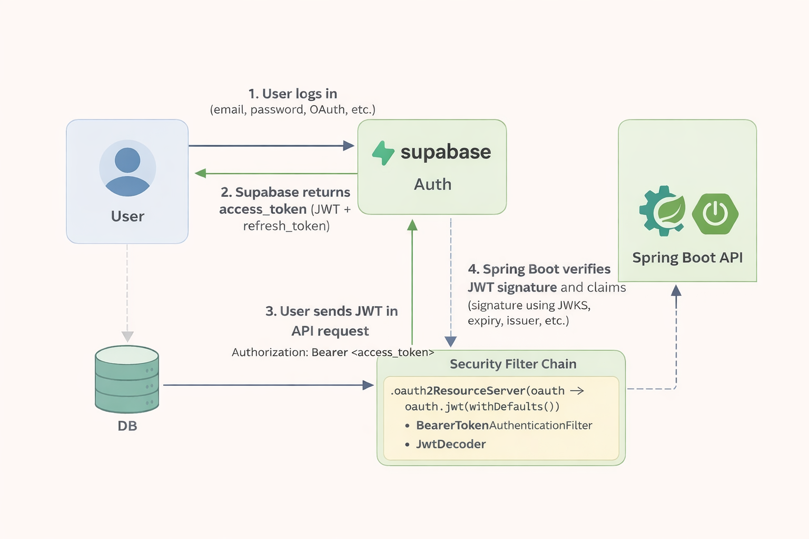

 There is a doc folder where you can find all the docs.

[Docker](src/main/java/com/buyology/backend/docs/docker-basics.md)

[Spring-Security(JWT)](src/main/java/com/buyology/backend/docs/JWT_Spring_Security.md)

[OIDC](src/main/java/com/buyology/backend/docs/OIDC.MD)

[Supabase](src/main/java/com/buyology/backend/docs/Supabase.md)

This 👇 (Supabase path) is Implemented to test the endpoints for backend only when going forward with the UI, I am using the different approach.

1. [ ] If you want to test just the endpoint from Backend Then n-comment the code from the SecurityConfig.java in config.`

## Telegram alert setup (local development)
If you are running locally and do not have deployment environment variables yet, you can configure Telegram alert values directly in `src/main/resources/application-secrets.properties`:

- `alerts.telegram.enabled-local=true`
- `alerts.telegram.bot-token-local=<your bot token from @BotFather>`
- `alerts.telegram.chat-id-local=<your chat id from getUpdates>`

The app resolves values in this order:
1. env vars (`TELEGRAM_ALERT_ENABLED`, `TELEGRAM_BOT_TOKEN`, `TELEGRAM_CHAT_ID`)
2. local fallback properties in `application-secrets.properties`

Low stock scheduler defaults can also be set locally:
- `alerts.stock.low-threshold-local=1`
- `alerts.stock.cron-local=0 50 1 * * *`
