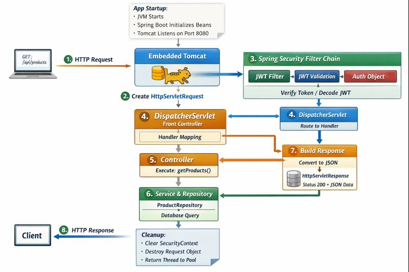

**🌐 Spring Boot Request Lifecycle (End-to-End)**

This section explains what happens from the moment a Spring Boot application starts until an HTTP response is sent back to the user.
It is written to help readers understand the full flow without jumping into code immediately.

**🚀 Application Startup Phase (Happens Once)**

When you run the application:

_java -jar application.jar_

The JVM starts first, and Spring Boot initializes the application by creating the ApplicationContext (Spring IoC container). During this phase, Spring scans the classpath for annotations such as @Configuration, @Component, @Service, @Repository, and @Controller. Based on these annotations, Spring creates all required beans, resolves their dependencies, and performs dependency injection. This entire setup happens once at startup, not per request.

After all beans are ready, the embedded Tomcat server (packaged inside the fat JAR) starts. Tomcat opens a TCP socket (usually on port 8080) and begins listening continuously for incoming HTTP requests.

At this point, the application is fully running and waiting for traffic.

**📩 Incoming HTTP Request Phase**

When a client (browser or Postman) sends an HTTP request, Tomcat receives it and parses the raw HTTP bytes. Tomcat converts this data into Java-friendly objects called HttpServletRequest and HttpServletResponse. These objects represent the incoming request and the outgoing response for this single request only.

Before the request reaches any controller, it is passed through the Servlet Filter Chain. If Spring Security is enabled, the Spring Security filters execute here. For JWT-based security, these filters read the Authorization header, extract the Bearer token, validate the JWT (signature, expiry, issuer, etc.), and either reject the request (401/403) or allow it to proceed by storing authentication details in the SecurityContext.

**🧭 DispatcherServlet & Controller Handling**

If the request passes security checks, it is forwarded to Spring MVC’s DispatcherServlet, which acts as the Front Controller. The DispatcherServlet determines which controller method should handle the request based on URL mappings and HTTP method annotations (@GetMapping, @PostMapping, etc.). It also prepares the method arguments by binding request data such as path variables, query parameters, headers, and request bodies.

The controller method executes business logic by calling the service layer, which may in turn interact with the repository layer to fetch or persist data.

**📤 Response Creation & Cleanup**

Once the controller returns a Java object, the DispatcherServlet converts it into the appropriate HTTP response format (typically JSON) using Jackson through Spring’s HttpMessageConverter mechanism. The serialized data is written into the HttpServletResponse, along with the HTTP status code and headers.

Finally, Tomcat sends the response bytes back to the client. After the response is sent, Spring performs cleanup: the SecurityContext is cleared, request objects are discarded, and the processing thread is returned to the thread pool. No request state is stored, ensuring a stateless and scalable architecture.

**🧠 Key Takeaway**

Spring builds the application at startup, Tomcat listens for traffic, Spring Security validates requests, DispatcherServlet routes and orchestrates execution, and everything is cleaned up after the response is sent.